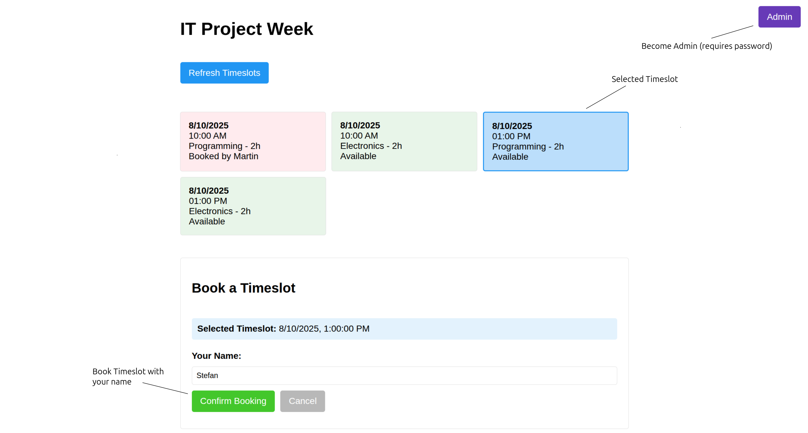
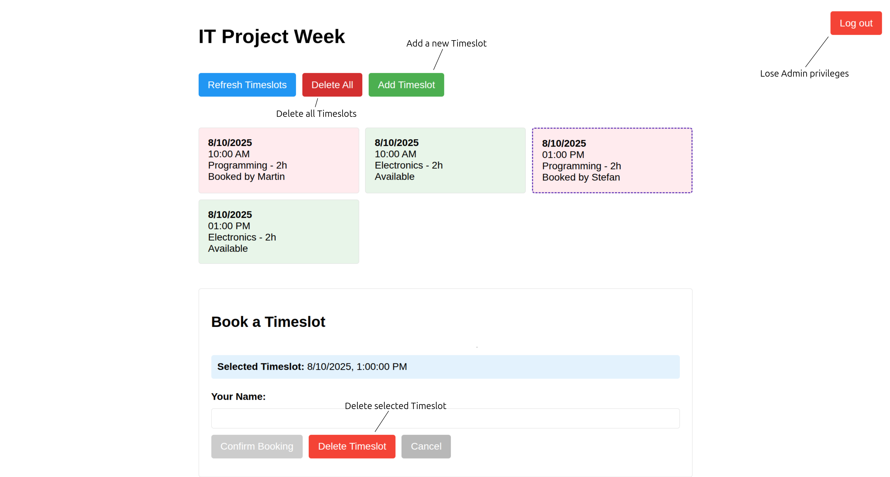

# booking-manager

A simple, self hostable booking tool written in Rust

## Background

My friend is teacher at a high school. For their project week they held some IT-related workshops. To organize everything properly I decided to help them with this very easy to use, device agnostic booking tool.


## How to use

### Client

- Open the address where the server is hosted in your browser
- As client you are able to select existing timeslots and book them by entering your name
- Timeslots are automatically updated on all devices connected to the server. In case you lose connection to the server you may have to press the `Refresh Timeslots` button or reload the website
- When a timeslot gets booked or outdates, its color changes. In this case the timeslot is not selectable by the client. 
<p align="center">

  <figcaption style="font-style: italic; margin-top: 8px;">
    Client view (no admin rights)
  </figcaption>
</p>

### Admin
- When pressing the Admin button you are requested to enter a password. When entering the correct password the admin features are enabled:
    - Add new Timeslots
    - Delete selected timeslots
    - Delete all Timeslots
- You don't have to manually delete outdated Timeslots. A specific time (currently 1 day) after the timeslot has expiried it's automatically removed.
<p align="center">

  <figcaption style="font-style: italic; margin-top: 8px;">
    Admin view (provides additional buttons)
  </figcaption>
</p>

## How to run

### Configuration

You can configure the booking manager either by adapting the **.env** file or by adding command line arguments. For help enter: 
``` Bash
$ cargo run -- -h
```
    
- Following can be configured:
    - Website title
        - By default the title is "Timeslot Booking Manager". You can change it to whatever you like. E.g. "IT Project Week"
    - Password
        - When requesting Admin rights, the password specified here has to be entered
    - Database Url
        - In case you want to run the booking manager in persistent mode, you can define the url of your database here. Alternatively, you can run the booking manager without database. Then, when shutting down the application, all the timeslots will be gone.
    - Port
        - Defines on which port the booking manager runs


### Run natively

1) Setup rust
2) navigate to the rust project: 
    ``` Bash
    $ cd booking_manager
    ```
3) to execute the application enter: 
    ``` Bash
    $ cargo run
    ```
4) In case you want your timeslots to be persistent you need to provide a postgres database:
    - Install Postgres Database and Diesel
    - adapt **.env** file according to your database
    - run migration to configure your database: 
    ``` Bash
    $ diesel migration run
    ``` 
    - adapt **booking_manager/diesel.toml**:
        - `dir = "~/personal_repos/rust/booking-manager/booking_manager/migrations"` has to be adapted according to your system


#### Run in docker

Todo